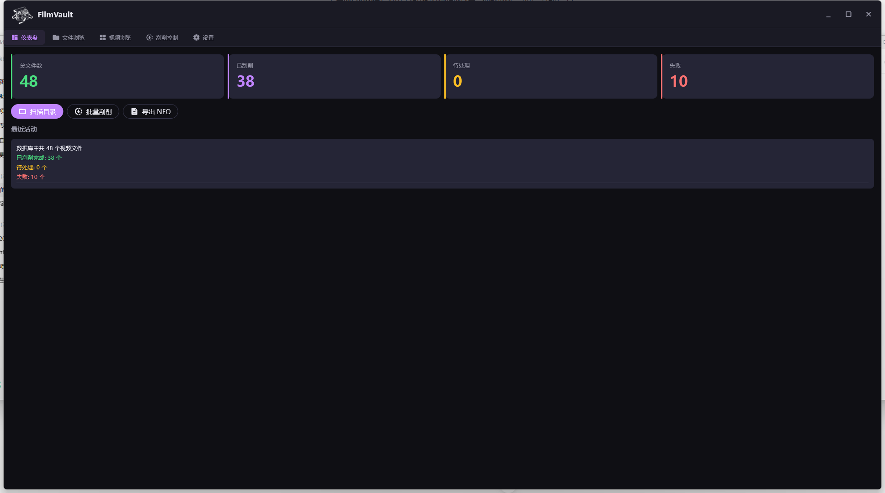
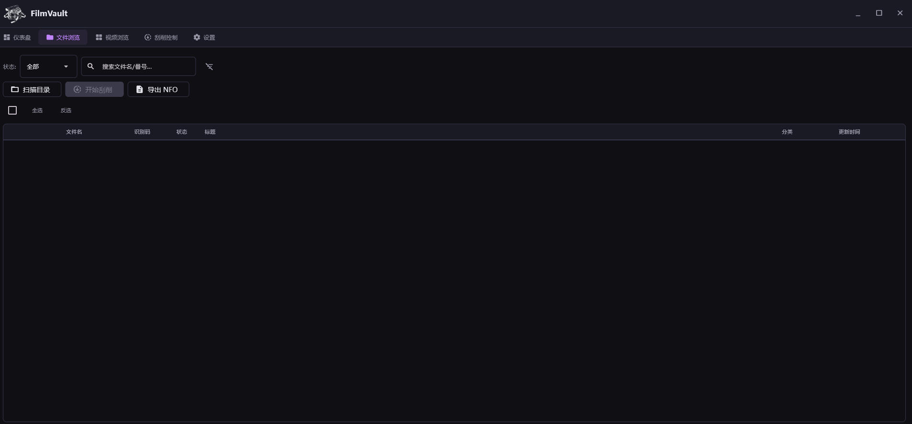
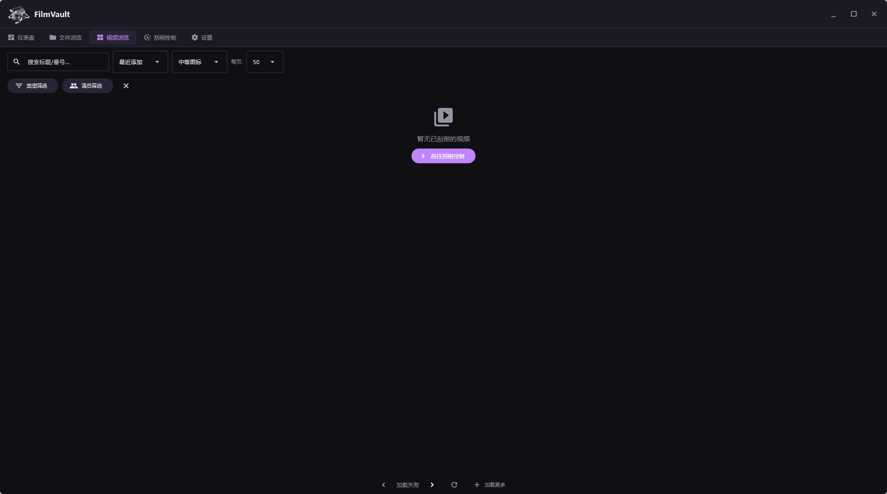
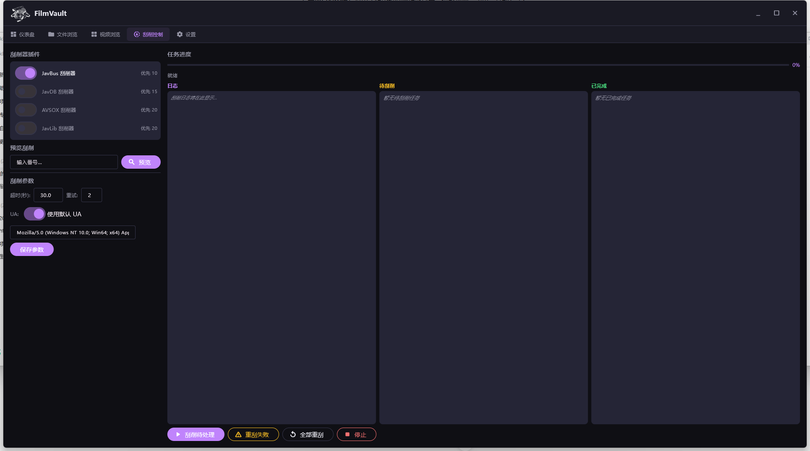
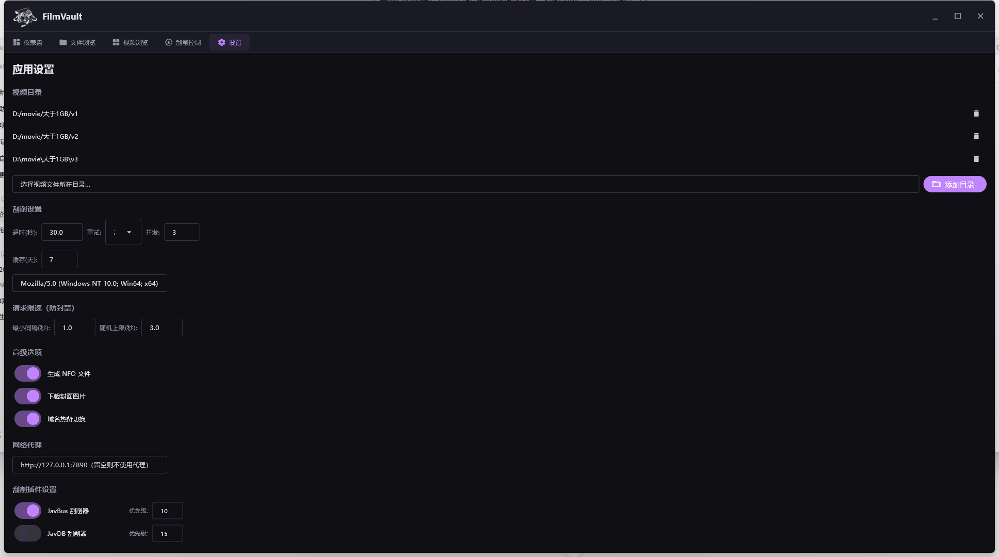

# FilmVault

> 现代化视频元数据刮削器 — 智能文件名解析 · 多源并行聚合 · Kodi NFO 生成

[](https://python.org)
[](https://flet.dev)
[](https://sqlalchemy.org)
[](https://github.com)
[](./LICENSE)

> **注意**：本项目完全由 AI 生成，未手写任何代码。功能较为简陋，仅供学习交流和技术验证使用。

> ⚠️ **免责声明**：本项目仅供技术学习和研究使用。使用者须遵守所在地法律法规，不得将本项目用于任何非法用途（包括但不限于盗版、侵权、非法传播）。作者不对任何滥用行为承担责任。禁止将本项目用于商业盈利目的。

---

## 截图预览

| 仪表盘 | 文件浏览 |
|:---:|:---:|
|  |  |

| 视频浏览 | 刮削控制 | 设置 |
|:---:|:---:|:---:|
|  |  |  |

---

## 功能特性

### 智能文件解析
- **正则引擎** — 从杂乱文件名中提取番号、标题、年份等元数据
- **命名规范化** — 自动识别 `ABC-123`、`abc123`、`[Group] ABC-123` 等多种命名风格
- **编辑距离匹配** — 模糊文件名也能精准匹配到正确条目

### 多源并行刮削
- **4 个内置数据源** — JavBus、JavDB、AVSOX、JavLib，自动发现并注册
- **并行聚合** — 同时查询所有启用源，取最快成功结果
- **智能回退** — 按优先级依次尝试，某个源失败自动切换下一个
- **速率限制** — 内置 500ms-1500ms 随机间隔 + 指数退避重试
- **404 缓存** — 已知不存在的番号自动跳过，避免重复浪费

### 元数据管理
- **标题** — 原始标题 + 多语言翻译
- **演职人员** — 演员、导演、制作商、发行商、系列
- **分类标签** — 100+ 日/英 → 中文分类映射，支持 CSV 扩展
- **海报与缩略图** — 自动下载并缓存到本地
- **发布日期、时长** — 完整的影片元信息

### Kodi NFO 生成
- **Kodi 兼容的 XML 格式** — Jinja2 模板驱动，输出标准的 `movie.nfo`
- **NFO 旁置模式** — 可选择将 NFO 文件写入视频文件同目录
- **自定义输出** — 修改 Jinja2 模板即可调整输出格式

### 插件系统
- **自动发现** — 将 `.py` 插件放入 `plugins/` 目录即自动加载
- **开发模板** — 提供 `_template.py` 快速开始新插件开发
- **配置驱动** — `site_configs.json` 支持纯 CSS 选择器配置，无需写代码即可添加新源
- **运行时管理** — 通过 GUI 启用/禁用插件、调整优先级

### 现代化 GUI
- **Flet + Flutter 桌面应用** — 原生性能，无浏览器依赖
- **暗色主题** — 暖紫色调暗色界面，长时间使用不刺眼
- **5 个功能页面** — 仪表盘、文件浏览、视频浏览、刮削控制、设置
- **自定义标题栏** — 品牌图标 + 风格化窗口控件
- **单实例保护** — 防止多开，重复启动自动激活已有窗口

---

## 快速开始

### 环境要求

- **Windows 10/11** (64-bit)
- **Python 3.11+**

### 安装

```bash
# 1. 克隆仓库
git clone https://github.com/yourusername/FilmVault.git
cd FilmVault

# 2. 创建虚拟环境
python -m venv .venv
.venv\Scripts\activate

# 3. 安装依赖
pip install -r requirements.txt
```

### 启动

```bash
# 方式一：双击 run.bat（推荐，无控制台窗口）
run.bat

# 方式二：命令行启动
python run_flet.py

# 方式三：虚拟环境 pythonw 启动（无控制台窗口）
.venv\Scripts\pythonw.exe run_flet.py
```

首次启动后，进入 **设置** 页面配置视频目录，然后切换到 **刮削控制** 页面开始刮削。

---

## 配置说明

配置可通过 **GUI 设置页面** 或 **环境变量** 两种方式管理，GUI 配置会自动持久化到 SQLite 数据库。

### 核心配置项

| 配置项 | 默认值 | 说明 |
|--------|--------|------|
| `video_directories` | 空 | 视频文件扫描目录列表 |
| `scraper_concurrency` | 3 | 并行刮削并发数 |
| `scraper_timeout` | 30s | 单个请求超时时间 |
| `scraper_retry` | 2 | 失败重试次数 |
| `scraper_interval` | 0.5s | 请求间隔（基础值） |
| `scraper_jitter` | 1.5s | 请求间隔随机抖动 |
| `cache_ttl_days` | 7 | 缓存有效期 |
| `proxy_url` | 无 | HTTP 代理地址 |
| `nfo_alongside_video` | true | NFO 是否写入视频旁 |

### 环境变量

所有配置均支持 `FV_` 前缀的环境变量覆盖，例如：

```bash
set FV_PROXY_URL=http://127.0.0.1:7890
set FV_SCRAPER_CONCURRENCY=5
```

---

## 插件系统

### 内置插件

| 插件 | 优先级 | 数据源 | 特点 |
|------|--------|--------|------|
| **JavBus** | 10 | javbus.com | 核心插件，CSS 选择器解析，域名热切换 |
| **JavDB** | 15 | javdb.com | Cookie 预热 + 两步搜索流程，编辑距离最佳匹配 |
| **AVSOX** | 20 | avsox.website | 与 JavBus 同结构，备用源 |
| **JavLib** | 20 | javlibrary.com | 最简化的元数据提取流程 |

### 开发自定义插件

1. 复制 `app/scraper/plugins/_template.py` 到新文件
2. 继承 `BaseScraper` 类
3. 实现 `search()` 和 `fetch_detail()` 方法
4. 修改 `name`、`display_name`、`base_urls` 等属性
5. 将文件放入 `app/scraper/plugins/` 目录

无需手动注册 — 系统会自动发现并加载。

### CSS 选择器配置（无代码方案）

编辑 `data/site_configs.json`，通过 JSON 配置 CSS 选择器即可添加简单站点支持：

```json
{
  "my_source": {
    "search_url": "https://example.com/search/{code}",
    "selectors": {
      "title": "h1.title",
      "date": "span.date",
      "cover": "img.poster"
    }
  }
}
```

---

## 项目结构

```
FilmVault/
├── run_flet.py              # 主启动文件（单实例保护）
├── run.bat                  # Windows 双击启动脚本
├── requirements.txt         # Python 依赖
│
├── app/
│   ├── config.py            # 全局配置（AppConfig dataclass）
│   ├── genre_mapper.py      # 分类标签映射（日/英 → 中文）
│   │
│   ├── database/            # 数据持久化
│   │   ├── engine.py        # SQLAlchemy async engine
│   │   ├── models.py        # ORM 模型（5 张表）
│   │   └── repository.py    # CRUD 操作封装
│   │
│   ├── flet_gui/            # Flet 桌面 GUI
│   │   ├── __init__.py      # 应用入口（FilmVaultApp）
│   │   ├── theme.py         # 暗色主题常量
│   │   └── pages/           # 5 个功能页面
│   │       ├── dashboard.py # 仪表盘
│   │       ├── files.py     # 文件浏览
│   │       ├── browser.py   # 视频浏览
│   │       ├── scraper.py   # 刮削控制
│   │       └── settings.py  # 设置
│   │
│   ├── nfo/                 # Kodi NFO 生成
│   │   ├── generator.py     # Jinja2 模板引擎
│   │   ├── schema.py        # Pydantic 数据模型
│   │   ├── writer.py        # NFO 文件写入
│   │   └── templates/
│   │       └── movie.nfo.j2 # Kodi NFO J2 模板
│   │
│   ├── parser/              # 文件名解析
│   │   ├── engine.py        # 正则解析引擎
│   │   ├── normalizer.py    # 文件名规范化
│   │   ├── number.py        # 数字/编辑距离工具
│   │   └── patterns.py      # 内置解析模式
│   │
│   ├── scraper/             # 刮削引擎
│   │   ├── base.py          # 抽象基类 + 元数据模型
│   │   ├── cache.py         # 404 缓存（7 天 TTL）
│   │   ├── engine.py        # 刮削引擎（重试/限速/并行）
│   │   ├── fallback.py      # 优先级回退链
│   │   ├── generic_html.py  # 通用 HTML 刮削器
│   │   ├── registry.py      # 插件自动发现/注册
│   │   ├── site_config.py   # JSON 配置驱动选择器
│   │   └── plugins/         # 数据源插件
│   │       ├── _template.py # 新插件开发模板
│   │       ├── javbus.py    # JavBus 刮削器
│   │       ├── javdb.py     # JavDB 刮削器
│   │       ├── avsox.py     # AVSOX 刮削器
│   │       └── javlib.py    # JavLib 刮削器
│   │
│   └── services/
│       └── scan_service.py  # 视频目录扫描服务
│
├── assets/
│   ├── icon.ico             # Windows 图标
│   ├── icon.png             # 应用图标
│   ├── icon_titlebar.png    # 标题栏图标
│   └── screenshots/         # 截图（README 用）
│
└── data/
    ├── scraper.db           # SQLite 数据库
    ├── site_configs.json    # 站点 CSS 选择器配置
    ├── not_found_cache.json # 404 缓存持久化
    ├── posters/             # 海报缓存
    └── thumbs/              # 缩略图缓存
```

---

## 技术栈

| 类别 | 技术 |
|------|------|
| **GUI 框架** | [Flet 0.85](https://flet.dev) + Flutter 引擎 |
| **数据库** | SQLite + [SQLAlchemy 2.0](https://sqlalchemy.org) (async) |
| **HTTP 客户端** | [httpx](https://www.python-httpx.org/) (async) |
| **HTML 解析** | [BeautifulSoup4](https://www.crummy.com/software/BeautifulSoup/) + lxml |
| **模板引擎** | [Jinja2](https://jinja.palletsprojects.com/) |
| **数据校验** | [Pydantic 2.0](https://docs.pydantic.dev/) |
| **图像处理** | [Pillow](https://python-pillow.org/) |
| **平台集成** | Win32 API (ctypes) — 窗口管理、单实例互斥锁 |

---

## 打包分发

使用 PyInstaller 打包为独立绿色版（无需安装 Python 环境，无控制台窗口）：

```bash
pip install pyinstaller
pyinstaller --onedir --windowed --name FilmVault \
    --hidden-import aiosqlite \
    --add-data "data/site_configs.json;data/" \
    --add-data "data/posters;data/posters/" \
    --add-data "data/thumbs;data/thumbs/" \
    --add-data "assets/icon.png;assets/" \
    --add-data "assets/icon.ico;assets/" \
    --add-data "assets/icon_titlebar.png;assets/" \
    run_flet.py
```

或直接双击项目根目录的 `build.bat` 一键构建。

打包后的 `dist/FilmVault/` 目录可直接复制到其他 Windows 电脑上运行。

---

## 开源协议

MIT License — 详见 [LICENSE](./LICENSE) 文件。

---

## 致谢

### 参考项目

**刮削方案参考：**
- [JavSP](https://github.com/Yuukiy/JavSP) — 番号刮削与整理工具
- [avbook](https://github.com/guyueyingmu/avbook) — 元数据数据库
- [JavScraper](https://github.com/JavScraper/Emby.Plugins.JavScraper) — Emby 刮削插件

**影音管理参考：**
- [Stash](https://github.com/stashapp/stash) — 媒体管理与元数据系统
- [Jellyfin](https://github.com/jellyfin/jellyfin) — 开源媒体服务器

### 依赖项目

- [Flet](https://flet.dev) — 用 Python 构建 Flutter 桌面应用
- [Jinja2](https://jinja.palletsprojects.com/) — Kodi NFO 模板渲染
- [httpx](https://www.python-httpx.org/) — 高性能异步 HTTP 客户端
- [SQLAlchemy](https://sqlalchemy.org) — 强大的 Python ORM
